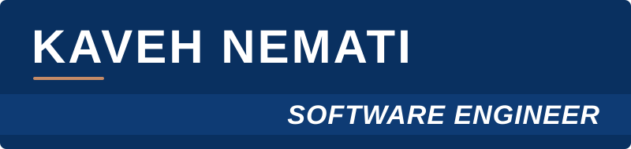

  <a href="mailto:kaavehnemati@gmail.com">kaavehnemati@gmail.com</a> 
  <a href="https://www.linkedin.com/in/kaveh-nemati-60415b20b/">LinkedIn</a> 
  Rasht, Iran

  
  
  
  
  
  

## PROFILE

Software Engineer with hands-on experience designing, building, deploying, and maintaining production software systems. Experienced across the software development lifecycle, including backend architecture, API design, database systems, testing, deployment, production troubleshooting, and ongoing system maintenance.

Comfortable working across multiple backend stacks, including **PHP/Laravel** and **Python/FastAPI**, with relational databases such as **PostgreSQL** and **MySQL**. Focused on building reliable, maintainable, and scalable software, improving existing systems, and solving technical problems in production environments.

Experienced with modern AI-assisted engineering workflows and coding agents such as **Claude Code** and **OpenAI Codex** for implementation, debugging, refactoring, technical analysis, documentation, and development automation.

## WORK EXPERIENCE

###  PAYSTAR

**Software Engineer** &nbsp;  
Full-time · On-site · Rasht, Iran

Designing, developing, and maintaining production software systems and backend services using PHP/Laravel and Python/FastAPI. Working with MySQL and PostgreSQL to build data-driven solutions, design RESTful APIs, and integrate internal and external services. Responsible for application deployment, server configuration, production maintenance, monitoring, and troubleshooting.

###  AVINA IT SOLUTIONS

**Software Engineer** &nbsp;  
Part-time · Remote · Tehran, Iran

Developing and maintaining backend services across PHP/Laravel and Python/FastAPI projects, with MySQL and PostgreSQL as primary databases. Designing RESTful APIs, implementing new features and service integrations, and contributing to architectural improvements and refactoring. Responsible for deployment workflows, production environment maintenance, and release management.

**Back-end Developer** &nbsp; 
Full-time · Remote · Tehran, Iran

Developed and maintained backend applications using PHP, Laravel, and MySQL, covering RESTful API development, authentication and authorization, business logic, database operations, and third-party integrations. Contributed to query optimization, debugging, refactoring, and deployment through Git-based workflows and code reviews.

###  PARDIS TECHNOLOGY PARK

**Quality Assurance Engineer** &nbsp; 
Full-time · Remote · Tehran, Iran

Focused on functional, API, regression, and automated testing of web applications. Designed and maintained automated tests using Cypress, tested REST APIs, investigated defects, and documented reproducible bug reports, working closely with developers to validate fixes.

**Software Engineer Intern** &nbsp; 
Full-time · Remote · Tehran, Iran

Worked on backend development using PHP, Laravel, and MySQL, contributing to REST API implementation, database operations, application logic, authentication, and bug fixing within collaborative, Git-based engineering workflows.

## SKILLS

**Backend Engineering** 
<kbd>PHP</kbd> <kbd>Laravel</kbd> <kbd>Python</kbd> <kbd>FastAPI</kbd> 
RESTful APIs · API Design · Service Integration · Authentication & Authorization

**Laravel Ecosystem** 
<kbd>Queues & Jobs</kbd> <kbd>Middleware</kbd> <kbd>Validation</kbd> <kbd>Eloquent ORM</kbd> <kbd>Sanctum</kbd> <kbd>Passport</kbd>

**Databases & Data** 
<kbd>PostgreSQL</kbd> <kbd>MySQL</kbd> <kbd>Redis</kbd> 
Database Design · Data Modeling · Query Optimization

**Cloud & Infrastructure** 
<kbd>AWS</kbd> <kbd>Linux</kbd> <kbd>Ubuntu</kbd> <kbd>VPS</kbd> <kbd>Docker</kbd> <kbd>Terraform</kbd> <kbd>GitHub Actions</kbd> 
Server Configuration · Application Deployment · Release Management · Monitoring · Troubleshooting

**Testing & Quality** 
<kbd>Cypress</kbd> <kbd>Postman</kbd> <kbd>Hoppscotch</kbd> 
Automated, API, Functional & Regression Testing · Bug Analysis & Reporting

**Development Tools** 
<kbd>Git</kbd> <kbd>GitHub</kbd> <kbd>GitLab</kbd> <kbd>Composer</kbd> <kbd>DirectAdmin</kbd>

**AI-Assisted Engineering** 
<kbd>Claude Code</kbd> <kbd>OpenAI Codex</kbd> 
AI Coding Agents · Agentic Development Workflows · Technical Analysis · Development Automation

**Software Engineering** 
Software Design · Object-Oriented Programming · SOLID Principles · MVC Architecture · Clean Code · Refactoring · Debugging · Code Review · Technical Problem Solving

## EDUCATION

**B.Sc. Computer Engineering** 
*University of Guilan* 
2020 – 2024

## HOW I WORK

#### 01 · Ownership in production
I deploy, monitor and support what I ship, and stay accountable for it after release.

#### 02 · Simplicity over cleverness
Readable, well-structured code built on SOLID principles, so every change stays safe.

#### 03 · Data done right
Careful schema design, sensible indexing and efficient queries are the foundation of reliable services.

#### 04 · AI-assisted, human-reviewed
Claude Code and Codex speed up implementation and debugging; I review every change before it ships.

