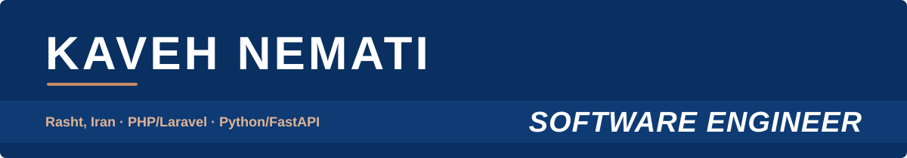

<table>
<tr>
<td width="34%" valign="top">

## CONTACT

**Email** 
[kaavehnemati@gmail.com](mailto:kaavehnemati@gmail.com)

**LinkedIn** 
[in/kaveh-nemati](https://www.linkedin.com/in/kaveh-nemati-60415b20b/)

**GitHub** 
[@kaavehnemati](https://github.com/kaavehnemati)

**Location** 
Rasht, Iran

## EDUCATION

**2020 – 2024** 
**UNIVERSITY OF GUILAN** 
Bachelor's in Computer Engineering

## SKILLS

**Software Engineering** 
Software Design 
Object-Oriented Programming 
SOLID Principles 
MVC Architecture 
Clean Code & Refactoring 
Debugging & Code Review 
Technical Problem Solving

**Backend Engineering** 
PHP · Laravel 
Python · FastAPI 
RESTful APIs & API Design 
Service Integration 
Authentication & Authorization

**Laravel Ecosystem** 
Queues & Jobs 
Middleware & Validation 
Eloquent ORM 
Sanctum & Passport

**Databases & Data** 
PostgreSQL 
MySQL 
Redis 
Database Design 
Data Modeling 
Query Optimization

**Cloud & Infrastructure** 
AWS 
Linux · Ubuntu · VPS 
Docker · Terraform 
GitHub Actions 
Server Configuration 
Application Deployment 
Release Management 
Monitoring & Troubleshooting

**Testing & Quality** 
Cypress 
Postman · Hoppscotch 
Automated & API Testing 
Functional & Regression Testing 
Bug Analysis & Reporting

**Development Tools** 
Git · GitHub · GitLab 
Composer 
DirectAdmin

**AI-Assisted Engineering** 
Claude Code 
OpenAI Codex 
AI Coding Agents 
Agentic Development Workflows 
Technical Analysis 
Development Automation

</td>
<td width="66%" valign="top">

## PROFILE

Software Engineer with hands-on experience designing, building, deploying, and maintaining production software systems. Experienced across the software development lifecycle, including backend architecture, API design, database systems, testing, deployment, production troubleshooting, and ongoing system maintenance.

Comfortable working across multiple backend stacks, including **PHP/Laravel** and **Python/FastAPI**, with relational databases such as **PostgreSQL** and **MySQL**. Focused on building reliable, maintainable, and scalable software, improving existing systems, and solving technical problems in production environments.

Experienced with modern AI-assisted engineering workflows and coding agents such as **Claude Code** and **OpenAI Codex** for implementation, debugging, refactoring, technical analysis, documentation, and development automation.

## WORK EXPERIENCE

 &nbsp;**PAYSTAR** &nbsp;Full-time | On-site | Rasht, Iran 
**Software Engineer** &nbsp;·&nbsp; *Nov 2025 – Present*

Designing, developing, and maintaining production software systems and backend services using PHP/Laravel and Python/FastAPI. Working with MySQL and PostgreSQL to build data-driven solutions, design RESTful APIs, and integrate internal and external services. Responsible for application deployment, server configuration, production maintenance, monitoring, and troubleshooting.

 &nbsp;**AVINA IT SOLUTIONS** &nbsp;Part-time | Remote | Tehran, Iran 
**Software Engineer** &nbsp;·&nbsp; *Oct 2025 – Present*

Developing and maintaining backend services across PHP/Laravel and Python/FastAPI projects, with MySQL and PostgreSQL as primary databases. Designing RESTful APIs, implementing new features and service integrations, and contributing to architectural improvements and refactoring. Responsible for deployment workflows, production environment maintenance, and release management.

 &nbsp;**AVINA IT SOLUTIONS** &nbsp;Full-time | Remote | Tehran, Iran 
**Back-end Developer** &nbsp;·&nbsp; *Feb 2025 – Oct 2025*

Developed and maintained backend applications using PHP, Laravel, and MySQL, covering RESTful API development, authentication and authorization, business logic, database operations, and third-party integrations. Contributed to query optimization, debugging, refactoring, and deployment through Git-based workflows and code reviews.

 &nbsp;**PARDIS TECHNOLOGY PARK** &nbsp;Full-time | Remote | Tehran, Iran 
**Quality Assurance Engineer** &nbsp;·&nbsp; *Apr 2024 – Jan 2025*

Focused on functional, API, regression, and automated testing of web applications. Designed and maintained automated tests using Cypress, tested REST APIs, investigated defects, and documented reproducible bug reports, working closely with developers to validate fixes.

 &nbsp;**PARDIS TECHNOLOGY PARK** &nbsp;Full-time | Remote | Tehran, Iran 
**Software Engineer Intern** &nbsp;·&nbsp; *Feb 2024 – Apr 2024*

Worked on backend development using PHP, Laravel, and MySQL, contributing to REST API implementation, database operations, application logic, authentication, and bug fixing within collaborative, Git-based engineering workflows.

</td>
</tr>
</table>

## HOW I WORK

<table>
<tr>
<td width="50%" valign="top">

**01 · Ownership in production** 
I deploy, monitor and support what I ship, and stay accountable for it after release.

</td>
<td width="50%" valign="top">

**02 · Simplicity over cleverness** 
Readable, well-structured code built on SOLID principles, so every change stays safe.

</td>
</tr>
<tr>
<td valign="top">

**03 · Data done right** 
Careful schema design, sensible indexing and efficient queries are the foundation of reliable services.

</td>
<td valign="top">

**04 · AI-assisted, human-reviewed** 
Claude Code and Codex speed up implementation and debugging; I review every change before it ships.

</td>
</tr>
</table>

