  

  
  
  

## About

Software Engineer with hands-on experience designing, building, deploying and maintaining
production backend systems. I work across **PHP/Laravel** and **Python/FastAPI** with
**PostgreSQL** and **MySQL**, owning features end to end, from API design and data modeling
to deployment, monitoring and production troubleshooting.

Currently a Software Engineer at **PAYSTAR** and **Avina IT Solutions**.

**Focus areas**
- Reliable, maintainable backend services and clean API design
- Service integrations, authentication and authorization
- Database design, data modeling and query performance
- Stable releases, production environments and troubleshooting
- AI-assisted engineering with Claude Code and OpenAI Codex

🎓 **B.Sc. Computer Engineering**, University of Guilan (2020–2024)

## Skills

<table>
  <tr>
    <td width="24%"><b>Backend</b></td>
    <td>
      <b>PHP · Laravel · Python · FastAPI</b> 
      RESTful APIs · API Design · Service Integration · Authentication &amp; Authorization 
      <b>Laravel:</b> Queues &amp; Jobs · Middleware · Validation · Eloquent ORM · Sanctum · Passport
    </td>
  </tr>
  <tr>
    <td><b>Databases &amp; Data</b></td>
    <td>
      <b>PostgreSQL · MySQL · Redis</b> 
      Database Design · Data Modeling · Query Optimization
    </td>
  </tr>
  <tr>
    <td><b>Production &amp; Deployment</b></td>
    <td>
      <b>Linux · Ubuntu · AWS · Docker · GitHub Actions · Terraform</b> 
      VPS · Server Configuration · Application Deployment · Production Environments · Release Management · Monitoring · Troubleshooting
    </td>
  </tr>
  <tr>
    <td><b>Testing &amp; Quality</b></td>
    <td>
      <b>Cypress · Postman · Hoppscotch</b> 
      Automated · API · Functional · Regression Testing · Bug Analysis &amp; Reporting
    </td>
  </tr>
  <tr>
    <td><b>Development Tools</b></td>
    <td>
      <b>Git · GitHub · GitLab · Composer · DirectAdmin</b>
    </td>
  </tr>
  <tr>
    <td><b>AI-Assisted Engineering</b></td>
    <td>
      <b>Claude Code · OpenAI Codex</b> 
      AI Coding Agents · Agentic Workflows · AI-assisted Debugging, Refactoring, Code Review &amp; Documentation · Technical Analysis · Development Automation
    </td>
  </tr>
  <tr>
    <td><b>Engineering Practices</b></td>
    <td>
      Software Design · OOP · SOLID · MVC · Clean Code · Refactoring · Debugging · Code Review · Technical Problem Solving
    </td>
  </tr>
</table>

## Journey

  

## Activity

  

